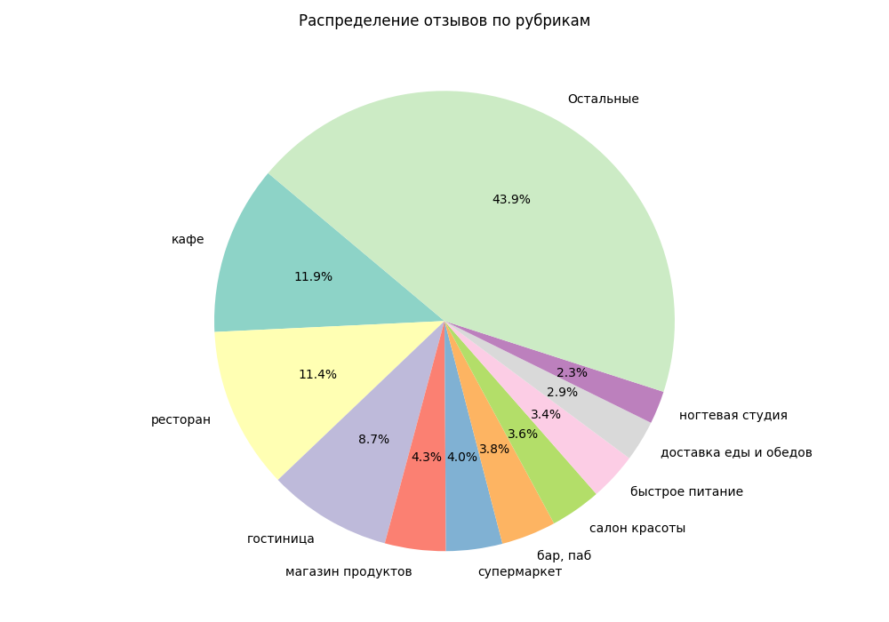
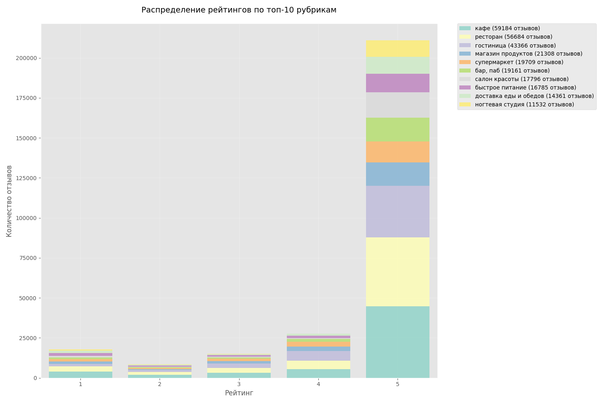
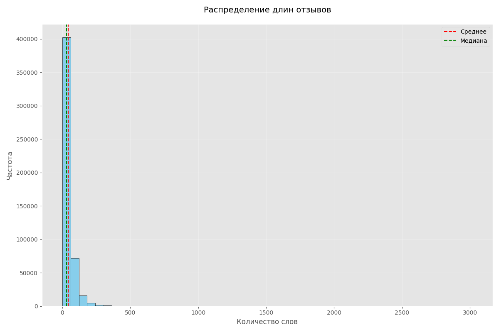
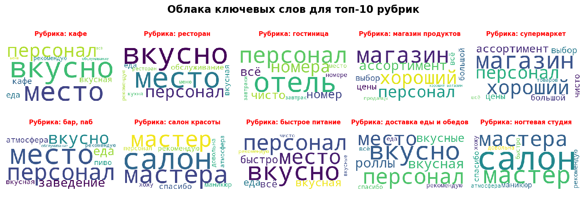

# Разведочный анализ данных (EDA)

Этот документ описывает процесс разведочного анализа данных, включая расчет базовых статистик, анализ рубрик и
визуализацию ключевых слов.

## Цель анализа

Выявить ключевые тенденции и особенности в отзывах клиентов. Мы стремимся:

- Понять распределение отзывов по рубрикам и рейтингам.
- Определить ключевые слова, часто встречающиеся в отзывах.
- Выявить области для улучшения на основе отзывов.
- Подготовить данные для дальнейшего анализа и принятия бизнес-решений.
- **Конечная цель**: Создать нейронную сеть, способную генерировать текстовые отзывы о различных местах на основе
  определенных входных параметров, таких как категория места, средний рейтинг и ключевые слова.

## Базовая статистика

Был произведен расчет базовых статистик для длины отзывов:

- **Среднее количество слов:** 44
- **Стандартное отклонение:** 45
- **Минимальное количество слов:** 1
- **Максимальное количество слов:** 3017
- **Медиана количества слов:** 30

### Выводы и рекомендации: распределение отзывов и их длина

- **Вывод:** Большинство отзывов короткие, с медианным значением в 30 слов. Это указывает на стремление клиентов быстро
  выражать свое мнение, что важно для адаптации модели генерации текста.
- **Рекомендации:** Модель должна быть способна генерировать как краткие, так и более подробные отзывы, в зависимости от
  контекста. Разработка модели с возможностью адаптации длины текста поможет улучшить качество результатов.

## Топ-10 рубрик

Определили топ-10 рубрик по количеству отзывов и их процентное соотношение:

1. **Кафе** - 59184 отзывов (12%)
2. **Ресторан** - 56684 отзывов (11%)
3. **Гостиница** - 43366 отзывов (9%)
4. **Магазин продуктов** - 21308 отзывов (4%)
5. **Супермаркет** - 19709 отзывов (4%)
6. **Бар, Паб** - 19161 отзывов (4%)
7. **Салон красоты** - 17796 отзывов (4%)
8. **Быстрое питание** - 16785 отзывов (3%)
9. **Доставка еды и обедов** - 14361 отзывов (3%)
10. **Ногтевая студия** - 11532 отзывов (2%)

Оставшиеся рубрики составляют 44% всех отзывов.

### Выводы и рекомендации: популярные рубрики

- **Вывод:** Основные категории, такие как "Кафе", "Ресторан" и "Гостиница", занимают большую долю всех отзывов, что
  отражает их популярность среди клиентов.
- **Рекомендации:** Модель должна быть обучена с фокусом на популярные рубрики, чтобы генерировать более релевантные и
  точные отзывы для этих сегментов. Можно также рассмотреть возможность адаптации модели под менее популярные рубрики,
  чтобы повысить точность генерации в них.

## Распределение рейтингов

### Выводы и рекомендации: распределение рейтингов

- **Вывод:** Большинство отзывов оцениваются положительно, что свидетельствует о высокой удовлетворенности клиентов.
- **Рекомендации:** При обучении модели следует учитывать позитивное распределение оценок, чтобы генерируемые отзывы
  отражали общий тренд положительных оценок. Также важно сбалансировать модель для учета разнообразных отзывов, включая
  негативные.

## Анализ длин отзывов

Распределение длин отзывов:

- **Средняя длина:** 44
- **Медиана длины:** 30
- **Стандартное отклонение:** 45
- **Минимальная длина:** 1
- **Максимальная длина:** 3017
- **25-й перцентиль:** 20
- **75-й перцентиль:** 52

### Выводы и рекомендации: анализ длин отзывов

- **Вывод:** В данных присутствует значительный разброс в длине отзывов, включая выбросы, что указывает на разнообразие
  в детализации обратной связи.
- **Рекомендации:** Рекомендуется проводить более детальный анализ длинных отзывов, чтобы выявить ценные инсайты.
  Сегментация клиентов по уровню детализации их отзывов также может быть полезной для более точной генерации текста.
  Предоставление клиентам шаблонов или подсказок для более структурированной обратной связи поможет собрать более
  целенаправленные данные.

## Извлечение ключевых слов

Использовали TF-IDF для извлечения ключевых слов из отзывов по рубрикам. Ключевые слова сохраняются в `keywords.json`.

### Выводы и рекомендации: ключевые слова и их значение

- **Вывод:** Ключевые слова, извлеченные с помощью TF-IDF, помогают выявить, что именно ценят или критикуют клиенты в
  разных категориях. Эти данные будут использоваться для настройки модели генерации текстов.
- **Рекомендации:** Ключевые слова должны быть использованы для улучшения модели генерации текстов, чтобы она могла
  более точно отражать предпочтения клиентов. Важно регулярно обновлять список ключевых слов в зависимости от изменений
  в отзывах и новых тенденций.

## Общие рекомендации:

1. **Балансировка классов:** При обучении модели необходимо учитывать дисбаланс в данных, особенно в отношении различных
   рубрик и оценок, чтобы избежать смещения модели в сторону преобладающих классов.
2. **Использование разнообразных данных:** Для создания более универсальной модели генерации текста рекомендуется
   использовать различные источники данных, включая подробные и краткие отзывы, а также разные рубрики.
3. **Оптимизация модели:** Регулярно тестировать модель на разных наборах данных, чтобы она могла адаптироваться к
   изменениям в структуре отзывов и предпочтениях клиентов.