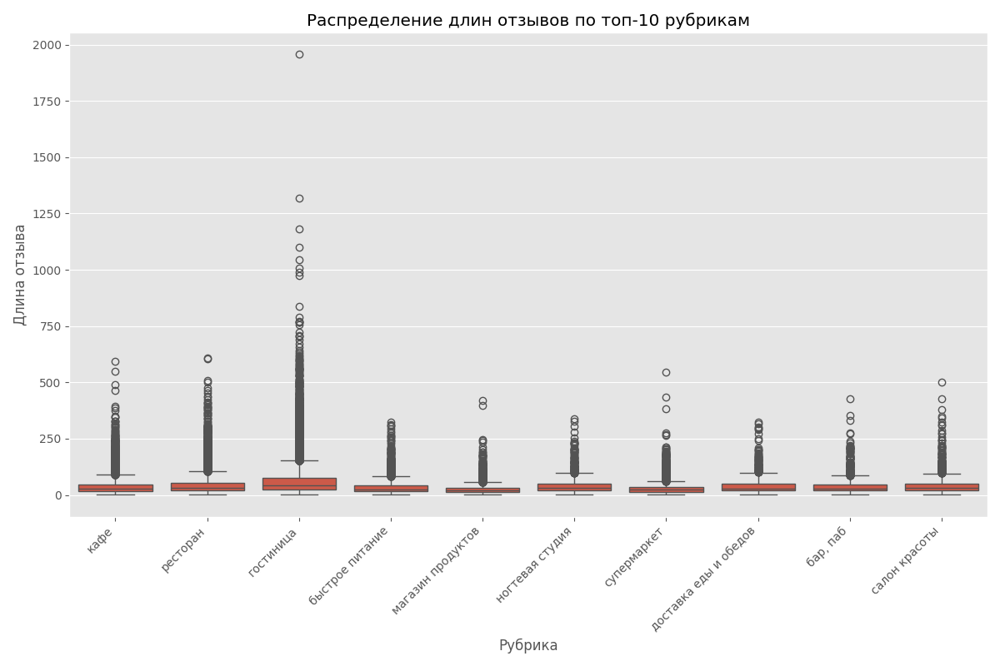

# Разведочный анализ данных (EDA)

Этот документ описывает процесс разведочного анализа данных, включая расчет базовых статистик, анализ рубрик и визуализацию ключевых слов.

## Цель анализа

Выявить ключевые тенденции и особенности в отзывах клиентов. Мы стремимся:

- Понять распределение отзывов по рубрикам и рейтингам.
- Определить ключевые слова, часто встречающиеся в отзывах.
- Выявить области для улучшения на основе отзывов.
- Подготовить данные для дальнейшего анализа и принятия бизнес-решений.
- **Конечная цель**: Создать нейронную сеть, способную генерировать текстовые отзывы о различных местах на основе определенных входных параметров, таких как категория места, средний рейтинг и ключевые слова.

## Базовая статистика

Был произведен рассчет базовых статистик для длины отзывов:

- **Среднее количество слов:** 44
- **Стандартное отклонение:** 45
- **Минимальное количество слов:** 1
- **Максимальное количество слов:** 3017
- **Медиана количества слов:** 30

### Выводы

Большинство отзывов содержат около 50 слов, что указывает на краткость и лаконичность большинства отзывов.
Это важно учитывать при разработке модели генерации текста, чтобы она могла адаптироваться к различным длинам отзывов.

## Топ-10 рубрик

Определили топ-10 рубрик по количеству отзывов и их процентное соотношение:

1. **Кафе** - 59184 отзывов (12%)
2. **Ресторан** - 56684 отзывов (11%)
3. **Гостиница** - 43366 отзывов (9%)
4. **Магазин продуктов** - 21308 отзывов (4%)
5. **Супермаркет** - 19709 отзывов (4%)
6. **Бар, Паб** - 19161 отзывов (4%)
7. **Салон красоты** - 17796 отзывов (4%)
8. **Быстрое питание** - 16785 отзывов (3%)
9. **Доставка еды и обедов** - 14361 отзывов (3%)
10. **Ногтевая студия** - 11532 отзывов (2%)

Оставшиеся рубрики составляют 44% всех отзывов.

### Круговая диаграмма

### Выводы

Наибольшее количество отзывов приходится на кафе и рестораны, что может свидетельствовать о высокой активности клиентов в этих категориях.
Это знание будет полезно при обучении модели, чтобы она могла генерировать более точные отзывы для популярных категорий.

## Распределение рейтингов

График распределения рейтингов по топ-10 рубрикам:

### Выводы

Большинство отзывов имеют положительные рейтинги, что указывает на удовлетворенность клиентов.
Модель должна учитывать это при генерации отзывов, чтобы отражать реальное распределение оценок.

## Анализ длин отзывов

Распределение длин отзывов:

- **Средняя длина:** 44
- **Медиана длины:** 30
- **Стандартное отклонение:** 45
- **Минимальная длина:** 1
- **Максимальная длина:** 3017
- **25-й перцентиль:** 20
- **75-й перцентиль:** 52

Гистограмма распределения длин отзывов:

### Выводы

Большинство отзывов краткие, что может указывать на желание клиентов быстро выразить свое мнение.
Это важно учитывать при обучении модели, чтобы она могла генерировать отзывы соответствующей длины.

## Распределение длин отзывов по топ-10 рубрикам

### Выводы

1. Медианная длина отзывов:

    Большинство рубрик имеют схожую медианную длину отзывов, что указывает на стабильность в объеме обратной связи.

2. Разброс данных:

    В некоторых рубриках, наблюдается значительный разброс в длине отзывов. Это может указывать на разнообразие в детализации отзывов.

1. Выбросы:

    Во всех рубриках присутствуют выбросы, что свидетельствует о наличии очень длинных отзывов. Это может быть связано с клиентами, которые подробно описывают свой опыт.

#### Рекомендации:

- Анализ выбросов: Рассмотрите возможность анализа длинных отзывов для выявления ценной информации, которую они могут содержать.

- Сегментация клиентов: Используйте данные о длине отзывов для сегментации клиентов по уровню детализации их обратной связи.

- Оптимизация обратной связи: Рассмотрите возможность предоставления клиентам шаблонов или подсказок для более структурированной обратной связи.

## Извлечение ключевых слов

Использовали TF-IDF для извлечения ключевых слов из отзывов по рубрикам. Ключевые слова сохраняются в `keywords.json`.

## Визуализация облака ключевых слов

Облака ключевых слов для топ-5 рубрик:

---

---

---

---

### Выводы

Ключевые слова помогают выявить, что именно клиенты ценят или критикуют в каждом из сегментов.
Эти данные будут использоваться для настройки модели генерации текстов.

## Выводы и рекомендации

- **Рубрики с высоким количеством отзывов**: Рекомендуется уделить внимание кафе и ресторанам для улучшения клиентского опыта и обучения модели.
- **Краткость отзывов**: Можно предложить клиентам оставить более подробные отзывы для получения более ценной обратной связи.
- **Положительные рейтинги**: Поддерживать высокий уровень сервиса, чтобы сохранить положительные впечатления клиентов.

Этот анализ предоставляет ценную информацию для принятия стратегических решений, улучшения клиентского сервиса и разработки модели генерации текстов.